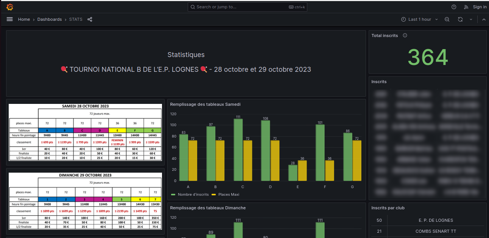
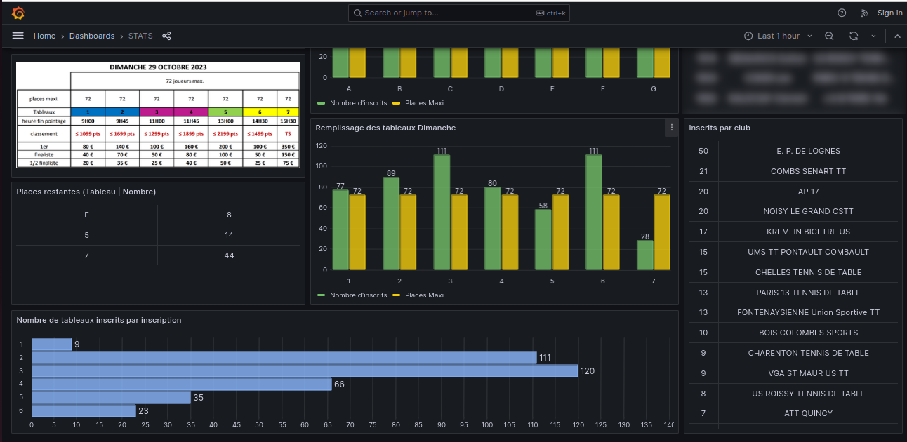

# tournoi

## Deployment

```bash
source .env
mkdir -p database/data
docker-compose up -d
```

## Upgrade

```bash
git pull
docker-compose build
source .env
docker-compose up -d
```

#### Dashboard




#### Annex

Ressources:
- HTML template: [https://github.com/alexandracaulea/freecodecamp-projects/tree/master/Responsive-Web-Design-Projects/Build%20a%20Survey%20Form](https://github.com/alexandracaulea/freecodecamp-projects/tree/master/Responsive-Web-Design-Projects/Build%20a%20Survey%20Form)
